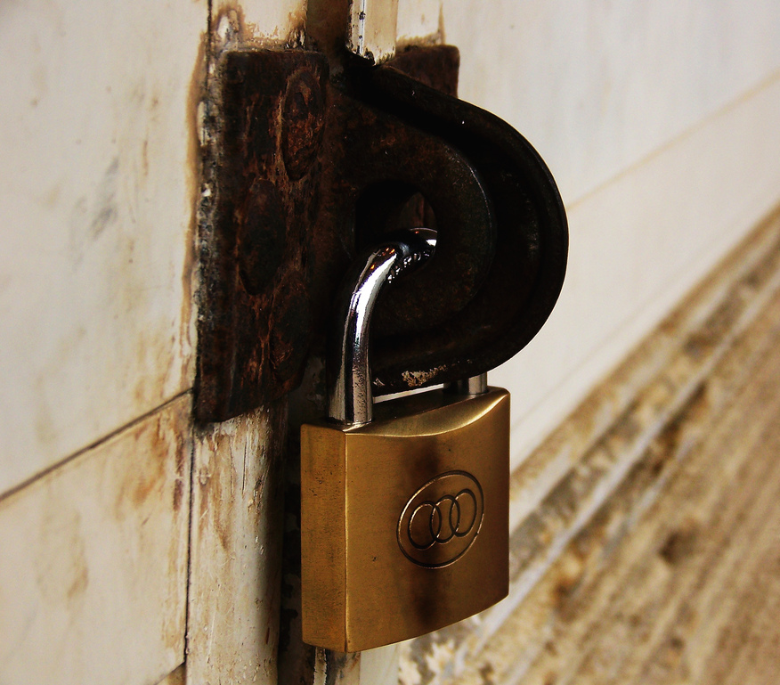

# Password Generator

A command-line password generator that creates cryptographically secure passwords following CISA security best practices.



## Overview

This tool generates strong, random passwords using Python's `secrets` module for cryptographically secure randomness. It was built as a learning project while working through "Automate the Boring Stuff with Python" and to create a personal utility for generating master passwords for password managers like Vaultwarden.

## Features

- **Cryptographically secure** password generation using Python's `secrets` module
- **Customizable length** via command-line flags (8-512 characters)
- **CISA-aligned defaults**: 16-character passwords by default
- **Character diversity**: Includes uppercase, lowercase, numbers, and symbols
- **No persistence**: Passwords never logged or stored, program outputs to stdout only
- **Input validation**: Enforces minimum (8) and maximum (512) length constraints

## Installation

No installation required. Uses only Python standard library modules.

**Requirements:**

- Python 3.6+

## Usage

### Basic Usage

```bash
# Generate default 16-character password
python passwd.py

# Generate custom length password
python passwd.py -l 32
python passwd.py --len 64

# Display help
python passwd.py -h
```

### Command-Line Options

| Flag           | Description                     | Example |
| -------------- | ------------------------------- | ------- |
| `-l`, `--len`  | Specify password length (8-512) | `-l 32` |
| `-h`, `--help` | Display help message            | `-h`    |

### Examples

```bash
# Default 16-character password
$ python passwd.py
aB3$xK9mP2qL@7nR

# 32-character password
$ python passwd.py -l 32
tY8@kL3nB9$mX2pQ7rZ4vH6wC1fG5jD0

# 128-character password for maximum security
$ python passwd.py --len 128
```

## Security Considerations

### Why `secrets` Module?

The `secrets` module generates cryptographically strong random numbers suitable for managing sensitive data like passwords, authentication tokens, and security keys. Unlike `random.Random`, which is designed for modeling and simulation, `secrets` provides randomness suitable for security-sensitive applications.

**From Python documentation:**

> "The `secrets` module is used for generating cryptographically strong random numbers suitable for managing data such as passwords, account authentication, security tokens, and related secrets."

### Password Length Limits

- **Minimum: 8 characters** — Industry baseline for acceptable password security
- **Maximum: 512 characters** — Aligned with SHA-512 key size
- **Default: 16 characters** — Follows CISA recommendations

### Why 512 Characters?

According to NIST guidance, extremely long passwords (megabytes) could require excessive processing time to hash. Although 512 characters is nowhere near the size to cause computational overhead, I chose this character limit because:

- Well within computational feasibility
- Matches SHA-512 cryptographic standard
- Far exceeds typical use cases while allowing room for future needs

## Design Decisions

### CISA vs. NIST Standards

This tool follows **CISA (Cybersecurity and Infrastructure Security Agency)** recommendations rather than NIST's evolving 2026 standards because:

1. **Accessibility**: CISA's 16-character minimum is achievable for everyday users without specialized IT infrastructure
2. **Practicality**: NIST's 15+ character recommendation with complex organizational password policies requires enterprise-level password management systems
3. **Target audience**: Designed for personal use and family members who need strong passwords without IT support

**CISA Best Practices Implemented:**

- ✅ At least 16 characters (default)
- ✅ Mix of uppercase, lowercase, numbers, and symbols
- ✅ Completely random (no personal info)
- ✅ Unique for each use case
- ✅ Designed to work with password managers

### Why Not Store Passwords?

This tool outputs passwords to stdout only because:

- **Security**: Storing passwords in logs or files creates attack vectors
- **Password managers exist**: Tools like Bitwarden, 1Password, and Vaultwarden handle secure storage
- **Single responsibility**: This tool generates; password managers store

## What I Learned

This project was an opportunity to learn several Python concepts and best practices:

### `argparse` Module

- How to create custom command-line interfaces
- Difference between positional and optional arguments
- Using `action="store_true"` for flags vs. `type=int` for values
- How argparse automatically handles input validation and help generation
- Understanding that `add_argument()` returns metadata, not user input
- The importance of calling `parse_args()` to actually process command-line arguments

### Error Handling

- When to use exceptions vs. simple if/else control flow
- Avoiding try/except for normal validation logic
- Proper use of `sys.exit()` for graceful error termination
- Initially overused try/except blocks—learned that exceptions are for unexpected errors, not routine validation

### Data Structures

- Working with Python's `string` module constants (`ascii_lowercase`, `punctuation`, etc.)
- List manipulation and concatenation
- Using `random.sample()` for secure shuffling vs. `random.shuffle()` (which returns `None`)
- Understanding when to build lists directly vs. converting from strings

### Security Practices

- Difference between `random` (pseudorandom) and `secrets` (cryptographically secure)
- Researching NIST and CISA password guidelines
- Understanding threat models for password generation

### Code Quality

- Importance of `if __name__ == "__main__":` for module reusability
- Deleting dead code instead of keeping "just in case" functions
- Writing clear, self-documenting code
- Proper use of logging for debugging without cluttering production output

## Troubleshooting & Resources

### Key Learning Resources

**Official Documentation:**

- [Python `secrets` module](https://docs.python.org/3/library/secrets.html)
- [Python `argparse` module](https://docs.python.org/3/library/argparse.html)
- [Python `string` module](https://docs.python.org/3/library/string.html)

**Community Resources:**

- [Why does random.shuffle() return None?](https://stackoverflow.com/questions/17649875/why-does-random-shuffle-return-none)
- [How to check if any character in a string is alphanumeric](https://stackoverflow.com/questions/44057069/checking-if-any-character-in-a-string-is-alphanumeric)
- [How to convert list to string](https://stackoverflow.com/questions/5618878/how-to-convert-list-to-string)
- [Argparse Basics - Command Line Tutorial](https://www.youtube.com/watch?v=FbEJN8FsJ9U)

**Security Guidelines:**

- [CISA: Use Strong Passwords](https://www.cisa.gov/secure-our-world/use-strong-passwords)
- [NIST: How Do I Create a Good Password?](https://www.nist.gov/cybersecurity/how-do-i-create-good-password)

### Common Issues During Development

1. **`random.shuffle()` returning `None`**: Had to learn that `shuffle()` modifies in-place and returns `None`, so I switched to `random.sample()` which returns a new shuffled list.

2. **Argparse confusion**: Initially tried to use the return value of `add_argument()` thinking it contained user input. Learned that `parse_args()` is what actually processes command-line arguments.

3. **Overusing try/except**: Started by wrapping validation logic in try/except blocks unnecessarily. Learned that simple if/else is cleaner for expected validation scenarios.

4. **String vs. list conversions**: Built strings then converted to lists. Learned to build lists directly when that's the intended data structure.

Potential improvements for future iterations:

- [ ] Integration with Vaultwarden API for direct password manager storage
- [ ] Add option to copy password directly to clipboard
- [ ] Add option to exclude symbols for systems with character restrictions
- [ ] Add passphrase generation mode (5-7 random words)
- [ ] Support excluding ambiguous characters (0/O, 1/l/I)

## Use Case

This tool was originally created to generate strong master passwords for self-hosted password managers like Vaultwarden. Since password managers already include built-in password generators, this serves as:

1. A **master password generator** for locking the password vault itself
2. A **learning project** to understand cryptographic randomness and CLI design
3. A **standalone utility** for quick password generation without opening a full password manager

**Why use a password manager?**

From CISA best practices:

> "Each password used for only one account. An organization-wide password manager makes it easier for employees to follow best practices. Employees only need to remember one strong master password for the password manager itself. This helps prevent password reuse, weak passwords, and accidental breaches."

## Contributing

This is a personal learning project, but suggestions and feedback are welcome! Feel free to open an issue or submit a pull request.

## License

MIT License - Feel free to use, modify, and distribute as needed.

## Author

**David Murillo Santiago**

Built as part of my cybersecurity and Python automation learning journey while working through "Automate the Boring Stuff with Python."

---

**Note**: This tool is designed for personal use and educational purposes. For enterprise password management, consult with your organization's IT security team and follow their established password policies.
